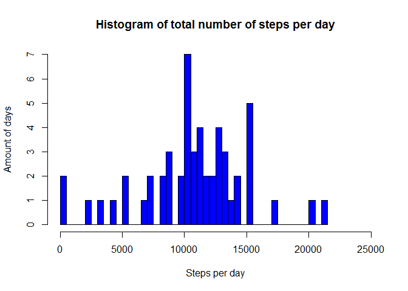
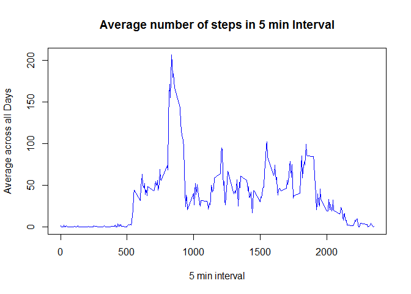
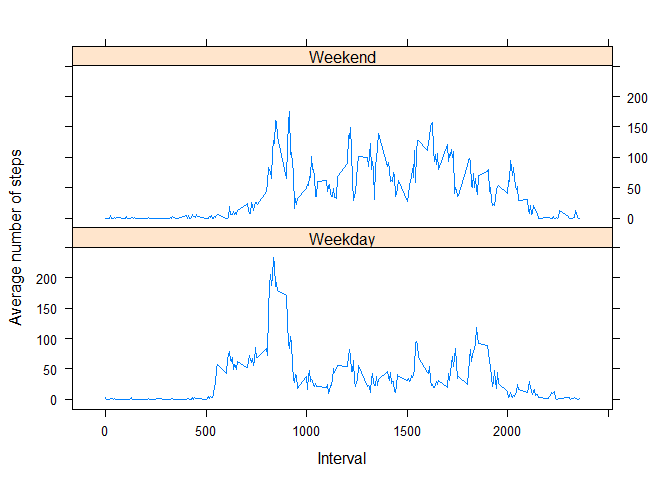

# Reproducible Research: Peer Assessment 1
This report was created for the Coursera Reproducible Research Course.
The initial repository was forked from https://github.com/rdpeng/RepData_PeerAssessment1 .
The figures are stored in default RStudio location  (PA1_template_files\figure-html)

## Loading and preprocessing the data
The dataset [Activity monitoring data](https://d396qusza40orc.cloudfront.net/repdata%2Fdata%2Factivity.zip) for this assignement was downloaded on 2015-09-19.

I also add a column with a date/time to the dataset.


```r
download.file('https://d396qusza40orc.cloudfront.net/repdata%2Fdata%2Factivity.zip', "activity_monitoring_data.zip")
unzip("activity_monitoring_data.zip")
allData <- read.csv("activity.csv")

times <- paste(allData$interval %/% 100, allData$interval %% 100, "00", sep = ":")
allData$dateTime <- strptime(paste(allData$date, times) , "%Y-%m-%d %H:%M:%S")
```

## What is mean total number of steps taken per day?
I use the plyr library and make a summary dataset containing the data I might need. For the mean and median calculation I remove the NA values.


```r
library(plyr)
dayData <- ddply(allData, ~date, summarize, mean=mean(steps), sd=sd(steps), median=median(steps, na.rm = TRUE), sum=sum(steps))

totalMean <- mean(dayData$sum, na.rm = TRUE)
totalMedian <- median(dayData$sum, na.rm = TRUE)

hist(dayData$sum, breaks = 50, main = "Histogram of total number of steps per day", xlab = "Steps per day", ylab = "Amount of days", col = "blue", xlim = c(0,25000))
```

 

The average number of steps per day is **10766** with the median of **10765**.

## What is the average daily activity pattern?
Lets calculate and graph the daily pattern


```r
intervalData <- ddply(allData, ~interval, summarize, mean=mean(steps, na.rm = TRUE), sd=sd(steps, na.rm = TRUE), median=median(steps, na.rm = TRUE), sum=sum(steps, na.rm = TRUE))

maxStepsInInterval <- intervalData[which.max(intervalData$mean),]$interval

plot(intervalData$interval, intervalData$mean, type = "l", xlab = "5 min interval", ylab = "Average across all Days", main = "Average number of steps in 5 min Interval", col = "blue")
```

 

**835** is the interval containing the most steps


## Imputing missing values


```r
totalNAs <- sum(is.na(allData$steps))
allDataWithoutNAs <- allData

for (i in 1:nrow(allDataWithoutNAs))
    if (is.na(allDataWithoutNAs[i,]$steps)) 
        allDataWithoutNAs[i,]$steps <- round(intervalData[intervalData$interval == allDataWithoutNAs[i,]$interval, ]$mean)


dayDataWithoutNAs <- ddply(allDataWithoutNAs, ~date, summarize, mean=mean(steps), sd=sd(steps), median=median(steps, na.rm = TRUE), sum=sum(steps))

totalMeanWithoutNAs <- mean(dayDataWithoutNAs$sum, na.rm = TRUE)
totalMedianWithoutNAs <- median(dayDataWithoutNAs$sum, na.rm = TRUE)

hist(dayDataWithoutNAs$sum, breaks = 50, main = "Histogram of total number of steps per day - modified", xlab = "Steps per day", ylab = "Amount of days", col = "red", xlim = c(0,25000))
```

 

There are in total **2304** missing values (NAs) in the original dataset.
My preference would be, not to fill the missing number, however for this assignement I will use the mean calculated for the specific interval over all days.

The average number of steps per day in the modified dataset is **10765** with the median of **10762**.


## Are there differences in activity patterns between weekdays and weekends?

Finally we compare the Means of Week and Weekend days. The locale has to be EN English_United States.1252.


```r
library(lattice)

weekend <- ifelse(weekdays(allData$dateTime) %in% c('Saturday','Sunday'), 'Weekend', 'Weekday')
allData$weekend <- weekend

intervalDataWeek <- ddply(allData, c('interval', 'weekend'), summarize, mean=mean(steps, na.rm = TRUE))

xyplot(mean ~ interval | weekend, intervalDataWeek, type = "l", layout = c(1, 2), xlab = "Interval", ylab = "Average number of steps")
```

 

